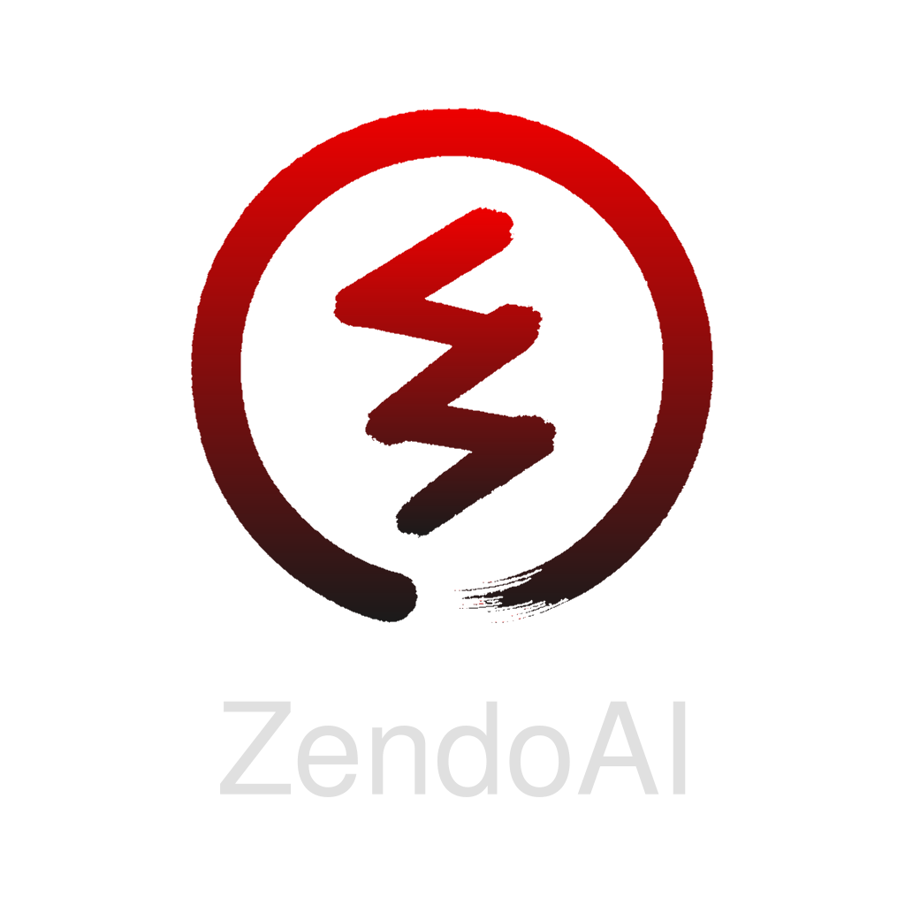

<p align="center">
  
</p>
<br>

A full-stack, modular generative AI platform for vision-based machine learning — created by [Dale Hutchinson](https://daletristanhutchinson.com).

# ZendoAI

**ZendoAI** is a modular, full-stack generative AI platform for training and evaluating image–text models.
It combines a Python backend (FastAPI), Rust modules (for performance-critical tasks), and a modern Next.js frontend for image annotation, model evaluation, and future image generation tools. Images and metadata are stored persistently using Fly.io volumes.

---

## 🚀 Features

- Upload, crop, and transform images in the browser
- Predict labels using CLIP embeddings via `/api/predict`
- Automatically save prediction metadata
- Persistent storage for uploads and database (Fly Volumes)
- Python–Rust hybrid backend (with optional Rust modules)
- Benchmark scripts for performance comparisons
- Plans for training workflows and image generation (e.g., StyleGAN2)

---

## 🧱 Project Structure

```
.
├── assets/                         # Logo and branding assets
├── backend/
│   ├── models/
│   │   └── openclip/               # Downloaded CLIP model (OpenCLIP)
│   ├── python/
│   │   ├── app/                    # FastAPI app and services
│   │   ├── pyproject.toml
│   │   └── requirements.txt
│   └── rust/                       # Rust performance modules and FFI bindings (optional)
│       ├── Cargo.lock
│       ├── Cargo.toml
│       ├── python/
│       ├── src/
│       └── target/
├── benchmarks/                     # Benchmark scripts
│   ├── benchmark_clip_inference.py
│   └── benchmark_transform.py
├── build.log
├── Dockerfile
├── Dockerfile-old
├── fly.toml                        # Deployment config for Fly.io (with volumes)
├── frontend/
│   ├── app/
│   ├── components/
│   ├── lib/
│   ├── out/
│   ├── public/
│   ├── README.md
│   ├── package.json
│   ├── package-lock.json
│   ├── postcss.config.mjs
│   ├── tsconfig.json
│   ├── globals.css
│   ├── layout.tsx
│   └── next.config.ts
├── pyrightconfig.json
├── README.md
├── rust-project.json
├── start-all.sh
└── tree.txt
```

---

## 🛠 Requirements

### Python Backend

- Python 3.12+
- FastAPI, Uvicorn, Pillow, pydantic, torch, open_clip_torch
- Install dependencies from `backend/python/requirements.txt`:

```bash
cd backend/python
pip install -r requirements.txt
```

### Rust Components (optional)

- Rust (stable)
- `tch`, `pyo3`, `image` crates
- Build from `backend/rust/` (if using Rust modules):

```bash
cd backend/rust
cargo build --release
```

---

## ⚙️ Running Locally

### Backend (FastAPI)

```bash
cd backend/python
uvicorn app.main:app --reload
```
Docs: [http://localhost:8000/docs](http://localhost:8000/docs)

### Frontend (Next.js)

```bash
cd frontend
npm install
npm run dev
```
App: [http://localhost:3000](http://localhost:3000)

### New Rust Backend + Frontend (Dev)

Use the Rust Axum backend with ONNX Runtime and the same Next.js frontend:

```
# Start both processes (backend on :8080, frontend on :3000)
./scripts/dev.sh

# Or individually
./scripts/start-backend.sh
./scripts/start-frontend.sh
```

Env vars for the Rust backend:
- `ZENDO_BIND_ADDR` (default `0.0.0.0:8080`)
- `ZENDO_UPSCALER_ONNX` (path to Real-ESRGAN x4 ONNX; if omitted, auto-detects `backend/models/Real-ESRGAN/RealESRGAN_x4plus.onnx`)
- `ZENDO_SDXL_DIR` (path to SDXL ONNX export dir; enables SDXL WebSocket inference)
- `ZENDO_STEPS` (default 30)
- `ZENDO_CONCURRENCY` (defaults to logical CPUs)

---

## 🚢 Deployment (Fly.io)

Persistent storage for uploads and database is configured using a Fly Volume.
**Sample `fly.toml` volume mount:**

```toml
[[mounts]]
source = "zendo_uploads"
destination = "/app/app/uploads"
```

To create a volume:

```bash
fly volumes create zendo_uploads --size 1 --region syd
```

Then deploy as usual:

```bash
fly deploy
```

---

## 🖼 Using the Predict API

Send a POST request to `/api/predict` with this format:

```json
{
  "filename": "example.jpg",
  "transform": {
    "x": 0.1,
    "y": 0.2,
    "scale": 1.5,
    "fit": "contain"
  }
}
```

The response will include the predicted label and similarity score.

---

## 🧪 Running Benchmarks

```bash
cd benchmarks
python benchmark_clip_inference.py
python benchmark_transform.py
```

---

## 💾 Persistent Storage

- All uploaded images and the SQLite metadata database are stored in a persistent Fly Volume (`/app/app/uploads`), ensuring data is not lost across deployments.
- Make sure to create and mount the volume before first deploy.

---

## 🧪 Future Development

- Add training interface for supervised fine-tuning
- Evaluate multiple CLIP variants
- Export dataset to Hugging Face format
- Generate photorealistic images using StyleGAN2

---

## 📄 License

MIT
